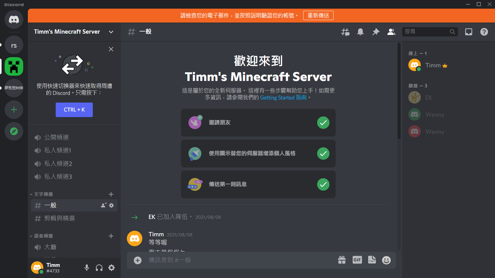
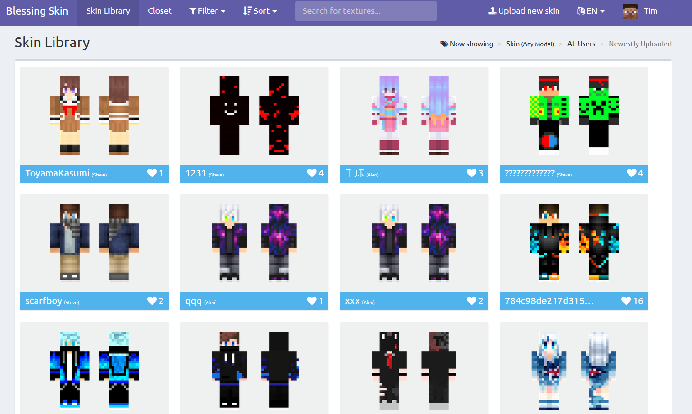
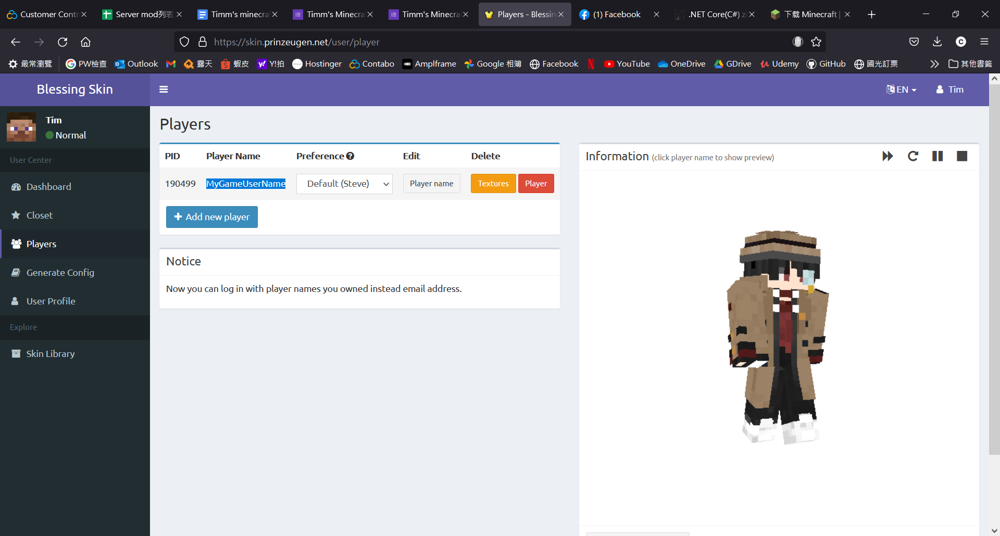
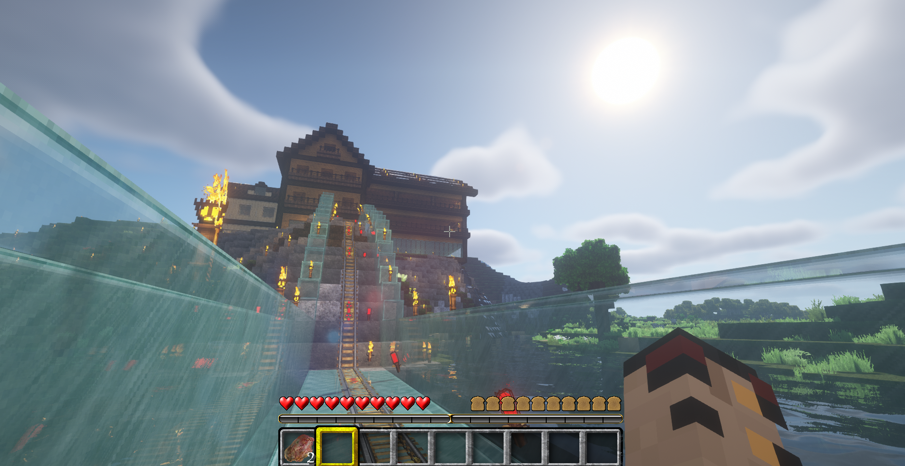

# Timm's Minecraft Server

* [協作地圖](https://docs.google.com/drawings/d/14CkqO0yurGKy7m1i6QX_AyAPa7ecaTq3OsKWUSnJWo4/edit?usp=sharing){:target="_blank"} 
* [模組與設定匯入小工具](https://github.com/timmchentw/Timms-Minecraft-Server/tree/main/files/Timm's%20Minecraft%20Tools)  
* [快速上手](https://docs.google.com/presentation/d/1msM5YNsXpt14wGQ0t3xbDOrEIKE55fgAX7pzxHYfUho/edit?usp=sharing) 
* [Mod圖說](https://docs.google.com/document/d/1Qc1ljT_9D0RBvlq08HDihXI4edl3lFVBeVYlCp3eM38/edit?usp=sharing) 
* [Mod詳細列表](https://docs.google.com/spreadsheets/d/1DfdwHGWw16sB9SxYdnkzX8Z524wlGDj4/edit?usp=sharing&ouid=115710445649749300574&rtpof=true&sd=true) 
* World Seed: -2084759484  
 

## 申請與安裝方法
伺服器採核准制、開發新地區請先通知OP (協作地圖劃領地，避免搶地)  
[>>填寫申請表單](https://docs.google.com/forms/d/e/1FAIpQLScS9ufVmnlSQZY-I-1Bgzz4fMALIoKJcxtk1ZWwJKomBBDzSw/viewform) 
[>>安裝步驟](./setup.md)

## 社群與資源
* Line官方帳號 
歡迎加入Line聊天機器人，可快速查看連結與即時接收伺服器更新通知! 
    

* Discord 
歡迎加入[Discord](https://discord.gg/XSmgz6SaTq)在遊戲中交談! 
    

* Skin:
    * [Official](https://www.minecraft.net/zh-hans/msaprofile/mygames/editskin)
    * [BlessingSkin](https://skin.prinzeugen.net/)
* 史萊姆區塊搜尋: 
    * [Chunkbase](https://www.chunkbase.com/apps/slime-finder)

## 伺服器須知
1. 伺服器地圖檔每天都會做備份，檔案保留三天 (平日24:00、假日12:00 & 18:00 & 24:00)
2. 考慮未來升版本，將不會更新已開發區域，再請盡量把家蓋在+-1000的座標以內，以便外圍區域套用到新版本內容
3. 地圖因檔案大小將定期刪除沒用到的區域，請盡量避免將物品放置在離市中心太遠的地方 (座標+-2000)
4. Skin Mod 建議使用正版帳號[上傳](https://www.minecraft.net/zh-hans/msaprofile/mygames/editskin)、或推薦第三方Skin站：[BlessingSkin](https://skin.prinzeugen.net/) 搭配MC-Laucher
      (不建議使用TLaucher進行遊戲，他有自己的Skin，另外也支援以下第三方skin站：LittleSkin, Elyby, SkinMe, GlitchlessGames) 
     
     
5. 伺服器會鎖定登入的user name (依據安裝第4步的輸入名稱來開通)，日後登入請用同一個user name進入
6. 如果進入伺服器遇到Mod List不符的錯誤訊息，請再用小工具更新Mods即可
7. 相同seed建立的新世界的地形都會一樣，可參考本伺服器的seed來搜尋史萊姆區塊

## 推薦光影模組與材質包
#### **[材質包]**
* 下載到C:/users/XXX/AppData/Roaming/.minecraft/resourcepacks
1. [Misa's Realistic (64x)](https://resourcepack.net/misas-realistic-resource-pack/) → 與原版風格較為搭配的擬真材質，順暢度較佳

2. [LB Photo Realism Reload! (128x)](https://www.curseforge.com/minecraft/texture-packs/lb-photo-realism-reload?__cf_chl_jschl_tk__=cT4oDCiCWcaSoG5w10BIlG0p0EW78OQ10VuWSPnfDAQ-1638681561-0-gaNycGzNDL0) → 極致擬真材質，火焰特效極佳 (可與Misa搭配，可套用到混合特效)

3. [Compliance (64x)](https://www.curseforge.com/minecraft/texture-packs/compliance-64x) → 原版風格的高畫質版本

4. [Steven's Traditional (64x)](https://www.curseforge.com/minecraft/texture-packs/stevens-traditional) → 原版風格還原度極高的版本，較為平滑

#### **[光影]**
* 下載到C:/users/XXX/AppData/Roaming/.minecraft/shaderpacks
1. [BLS](https://www.curseforge.com/minecraft/customization/bsl-shaders) → 光暈效果極佳，目前最滿意

2. [Complementary Shaders](https://www.curseforge.com/minecraft/customization/complementary-shaders) → 介於上者與下者

3. [Tea Shaders](https://www.curseforge.com/minecraft/customization/beyondbelief-vanilla-reborn) → 效果較少，效能較佳

4. [SEAUS](https://www.sonicether.com/seus/) → 經典光影模組

Misa (ResourcePack) + BLS (Shaders)