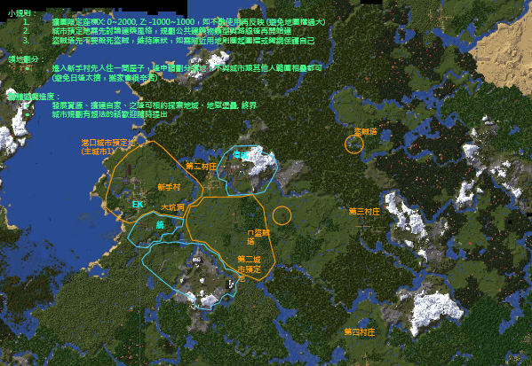

#Timm's Minecraft Server

* [協作地圖](https://docs.google.com/drawings/d/14CkqO0yurGKy7m1i6QX_AyAPa7ecaTq3OsKWUSnJWo4/edit?usp=sharing) 
* [模組與設定匯入小工具](https://github.com/timmchentw/Timms-Minecraft-Server/tree/main/files/Timm's%20Minecraft%20Tools)  
* 快速上手 
* Mod圖說 
* Mod詳細列表 
 

##安裝與申請方法
伺服器採核准制、開發新地區請先通知OP (協作地圖劃領地，避免搶地)  
[填寫申請表單](https://docs.google.com/forms/d/e/1FAIpQLScS9ufVmnlSQZY-I-1Bgzz4fMALIoKJcxtk1ZWwJKomBBDzSw/viewform)

##社群
* Line官方帳號 
歡迎加入Line聊天機器人，可快速查看連結與即時接收伺服器更新通知! 

* Discord 
歡迎加入[Discord](https://discord.gg/XSmgz6SaTq)在遊戲中交談! 

