# Timm's Minecraft Server安裝方法

1. [安裝Minecraft](#i-%E5%AE%89%E8%A3%9Dminecraft)
2. [安裝MOD與初始設定](#ii-%E5%AE%89%E8%A3%9Dmod%E8%88%87%E5%88%9D%E5%A7%8B%E8%A8%AD%E5%AE%9A)
3. [連線到多人伺服器](#iii-%E9%80%A3%E7%B7%9A%E5%88%B0%E5%A4%9A%E4%BA%BA%E4%BC%BA%E6%9C%8D%E5%99%A8)
4. [匯入地圖檔](#iv-%E5%8C%AF%E5%85%A5%E5%9C%B0%E5%9C%96%E6%AA%94)
* [疑難排解](#%E7%96%91%E9%9B%A3%E6%8E%92%E8%A7%A3)

## I 下載Server安裝小工具**
  
  1. 下載[檔案匯入小工具](https://drive.google.com/file/d/13wBE3E1xyvtOcqAntxPvxp8QNv1LhS4z/view?usp=sharing)的壓縮檔
  2. 解壓縮後點選"TimmsMinecraftTool.exe"

      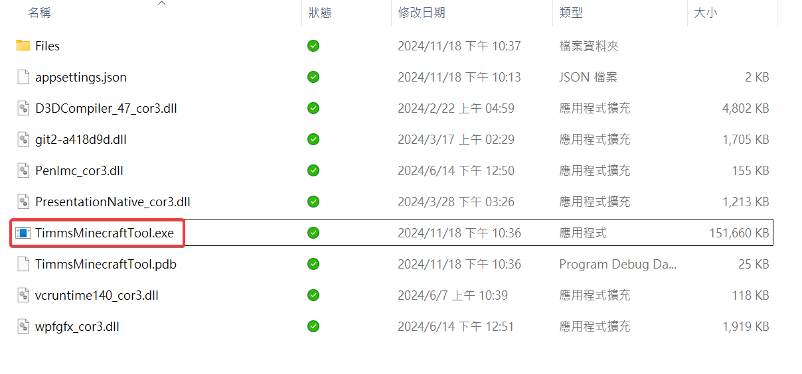 

  3. 依照下圖順序進行安裝 (請先依照下方指示完成第1、2點)

      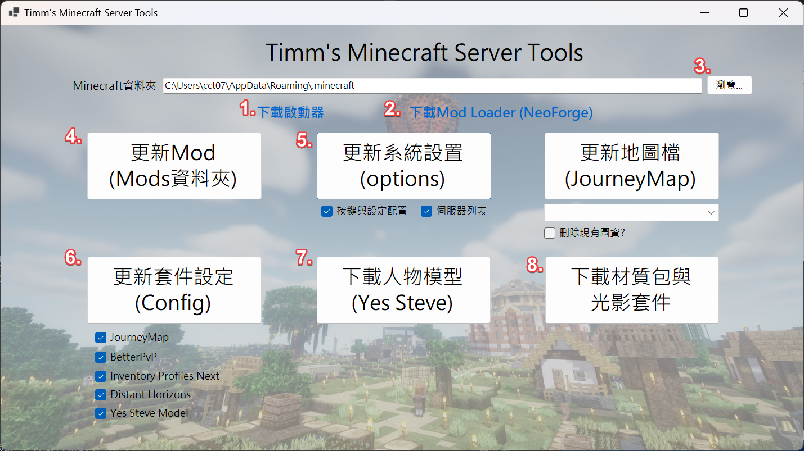 

## II 安裝Minecraft

  可使用[官方啟動器](#購買正版啟動器)或[第三方啟動器](#第三方啟動器)，請斟酌選擇

* ### 購買正版啟動器

1. [一次性購買](https://www.minecraft.net/zh-hans/store/minecraft-java-edition)帳號 (Java版) 

2. 下載與安裝[啟動器](https://www.minecraft.net/zh-hans/download)(小工具中也有提供連結)  

    2-1 開啟Launcher登入已購買的帳號  
    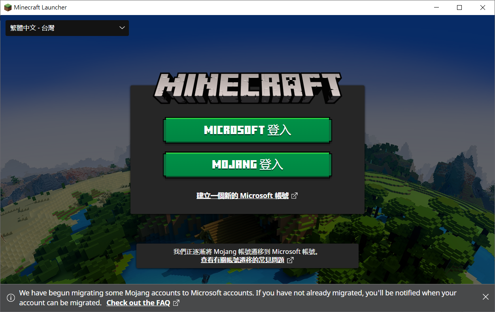  
  
    2-2 點選Java Edition確認畫面OK，直接關閉啟動器 
      

3. 安裝NeoForge (Mod Loader)  

   下載與安裝版本小工具提供的NeoForge版本，打開選Install client  
      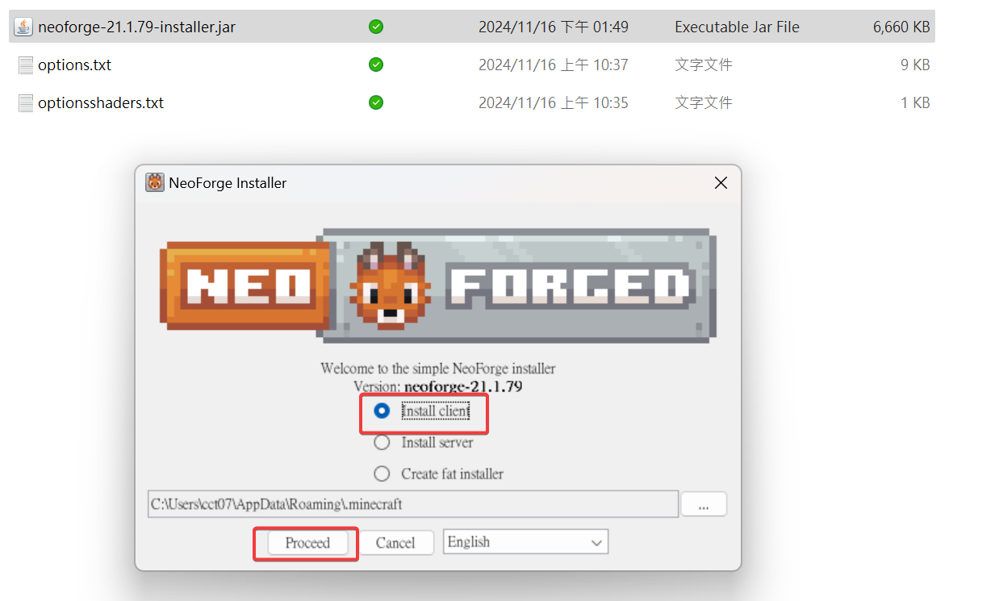 

4. 安裝Minecraft本體

    4-1 開啟啟動器，會發現多了NeoForge的遊戲版本，接著點選安裝檔頁籤  
      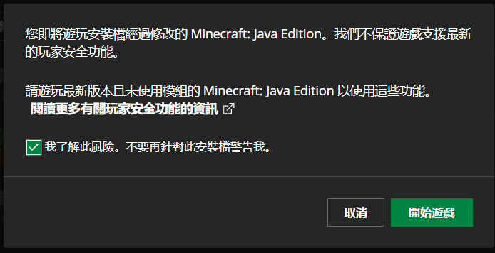  

    4-2 點選"更多選項"，設定擴大啟動RAM為4或8G (避免開啟時記憶體不足跑很久)   
      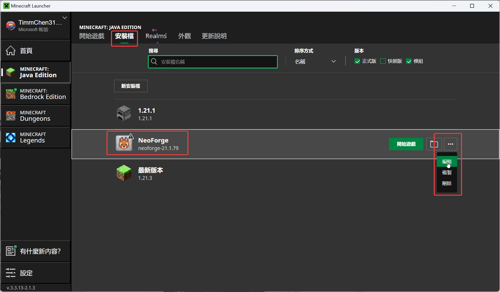  
      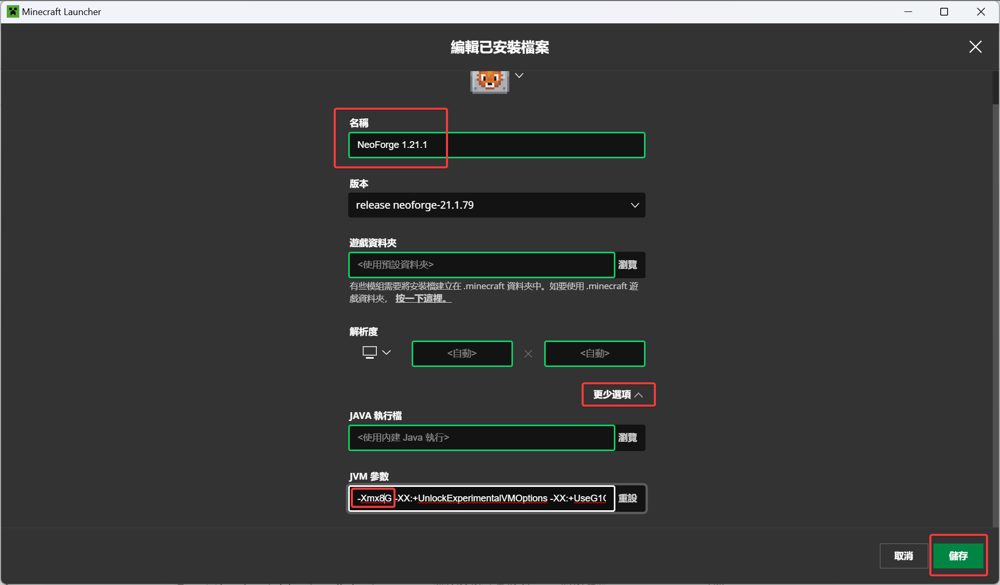  

    4-3 點選這個版本的NeoForge，點開始遊戲進入安裝程序! 
      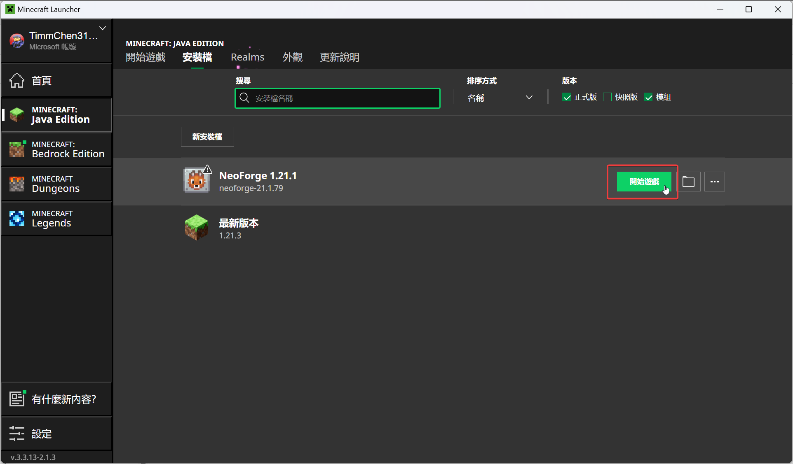  

    - 太麻煩的話，建議直接使用第三方Launcher，也可登入正版帳密 (MC-Launcer、MultiMC、ATLauncher都不錯用) 

* ### 第三方啟動器 
  推薦使用[MC-Launcher](https://mc-launcher.com/)  

1. 先建立帳戶 

      

2. 選擇正版(輸入帳密或名稱)或其他帳戶(僅需遊戲ID) 

    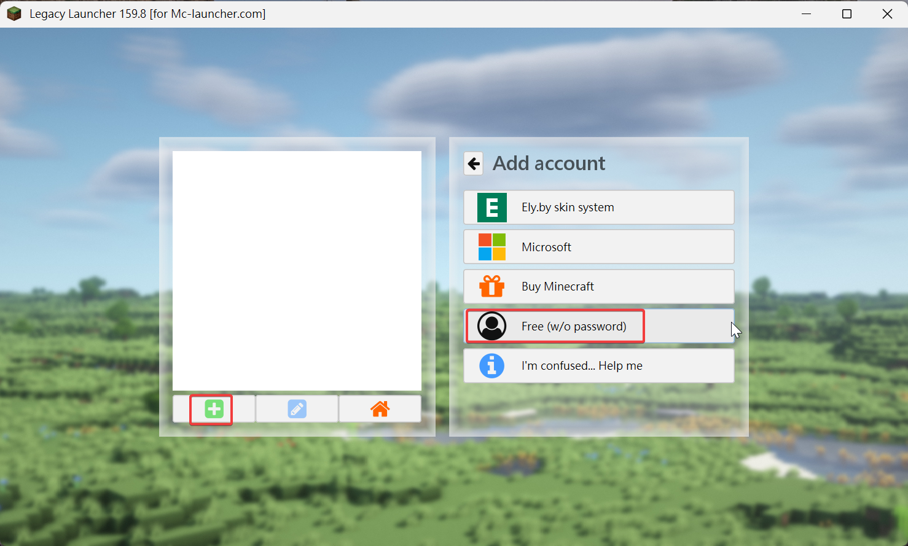  
    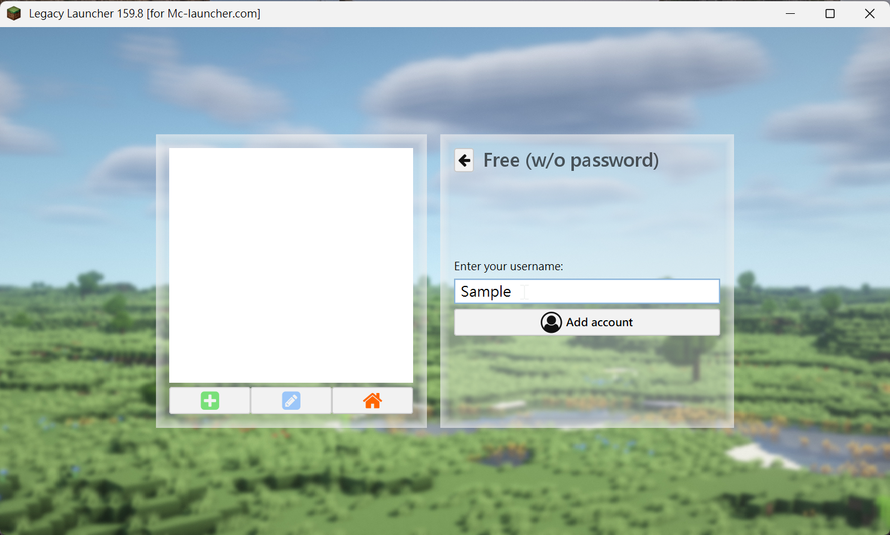  

3. 選定安裝版本，按進入遊戲即可! 

    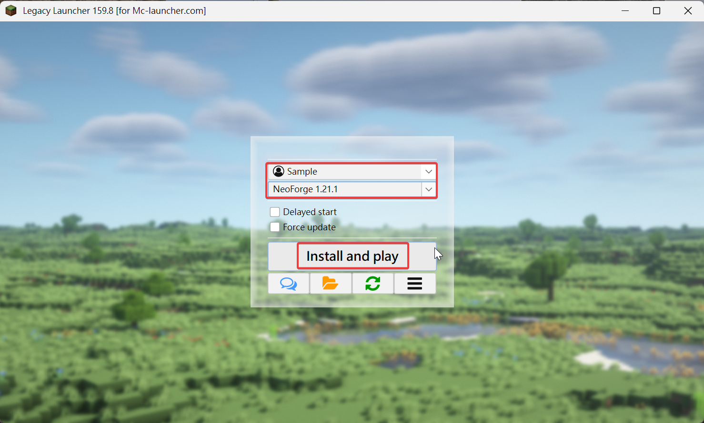  

  
## III 安裝MOD與初始設定

1. 請先關閉Minecraft遊戲，接下來要進行伺服器初始化設定
2. 返回Server小工具

     

3. 選定設定資料夾: 

    正版啟動器不需更改Minecraft資料夾、第三方啟動器請自行選擇 (位址請參考上方MC-Launcher的資料夾圖示)

4. **點選"安裝Mods"** 

    會直接下載目前伺服器所需的所有MOD (下載期間請耐心等待) 
    ※ 注意私自安裝的MOD會一併作刪除，更新前請先備份好 
    (預設路徑為 C:/Users/XXX/AppData/Roaming/.minecraft/mods) 

5. **點選"更新按鍵配置"** 

    會套用符合使用的按鍵設定、語言、資源包設定，伺服器列表也可選(會加入此伺服器)等 
    (路徑為 C:/Users/XXX/AppData/Roaming/.minecraft/options.txt & server.dat) 
    ※ 數字鍵區將會集中設定按鈕，遊戲中請試點看看!

6. **點選"更新套件設定"** 

    勾選下方的目標套件進行更新，即可套用最新的MOD設定 
    ※ JourneyMap為小地圖模組，將調整字體大小為適中、並關閉Waypoint介面干擾 
    ※ BetterPvp為介面模組，有重複的小地圖功能，將設定關閉 
    ※ Inventory Profile Next為裝飾裝備模組，將關閉會干擾物品欄顯示的箭頭圖案 
    ※ Distant Horizons為遠方景觀模組，將會關閉雲的顯示(推薦關閉是因為會跟光影模組重複) 
    ※ Yes Steve Model為立體人物模組，將把第三人稱小人物預覽移到介面右下角 

7. **點選"下載人物模型"**

    預設Yes Steve僅有約5個人物模組，這邊可再下載近100個人物模組! 
    (注意會下載比較久!) 
     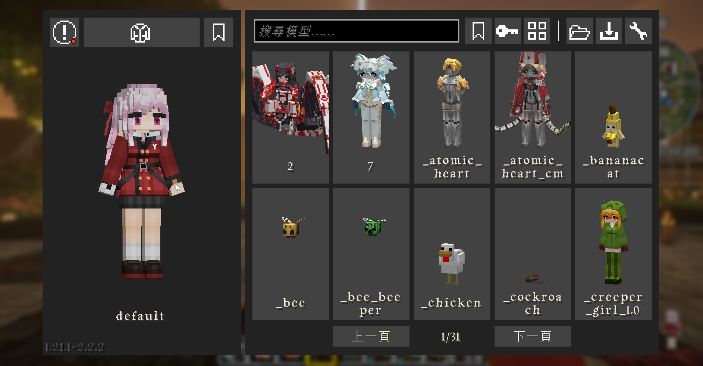  -> 按"數字鍵Enter"可開啟選單!

8. **點選"下載材質包與光影套件"**
    點選會下載多個精挑細選的材質包與光影模組，請斟酌使用!

9. **重開Minecraft，將重新讀取Mod與設定** 
  

## IV 連線到多人伺服器

  1. **新增多人伺服器** 

      點選多人遊戲 → 如果剛才小工具有勾選更新"伺服器列表"，將顯示此伺服器 (網址為minecraft.timmchen.com) 

  2. **送出申請表單** 

      第一次進入伺服器會被擋住，請先到[表單連結](https://docs.google.com/forms/d/e/1FAIpQLScS9ufVmnlSQZY-I-1Bgzz4fMALIoKJcxtk1ZWwJKomBBDzSw/viewform)填寫入伺服器申請， 
      送出表單後，通知OP人工核准後始可登入 
       

## V 匯入地圖檔 (暫時關閉)

* Server使用JourneyMap Mod作為世界地圖，圖資生成存在自己電腦內 (自己要開黑色區域)，並可儲存WayPoints指出方位，可參考[Mod官網](https://journeymap.info/Multiplayer_Server_Map)
* 請使用上方提到的"[匯入小工具](#i-下載server安裝小工具)"，將最新版的全地圖檔匯入剛才新增的"多人世界" (下拉式選單選擇名稱)，重新進入世界後即可全開地圖!
* 地圖檔只會在自己周圍更新，因此推薦可造飛機多繞繞地圖~ 
    (地圖檔路徑在 C:\users\XXX\AppData\Roaming\.minecraft\journeymap\data\mp\SERVER_NAME)

    ※ 匯入地圖檔請在進入多人遊戲後，再做匯入，否則找不到多人世界的資料夾! 
    ※ 日後伺服器MOD或地圖檔有更新時，再打開小工具快速更新即可!  

    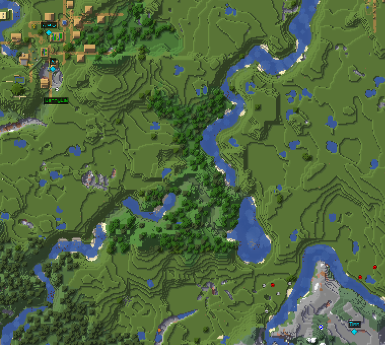  
    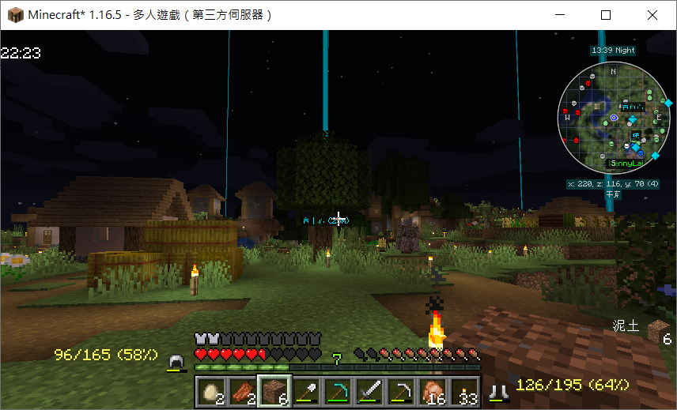  

## 疑難排解

1. 安裝有問題的話請裝[Java](https://www.java.com/zh-TW/download/manual.jsp)看看
2. 如果進入伺服器遇到Mod List不符的錯誤訊息，請再用小工具更新Mods即可
3. 因Mod眾多，按鈕有許多衝突，建議一定要用小工具匯入options.txt，確保按鈕都正常運作 (也可在ESC→選項→按鍵設定)
4. 預設Minecraft僅允許2GB的RAM使用量，如使用光影或較細緻的材質包切換時可能會使遊戲當掉，建議務必在啟動器的"安裝檔設定"當中將"-Xmx2G"擴大到至少"-Xmx4G"以上
