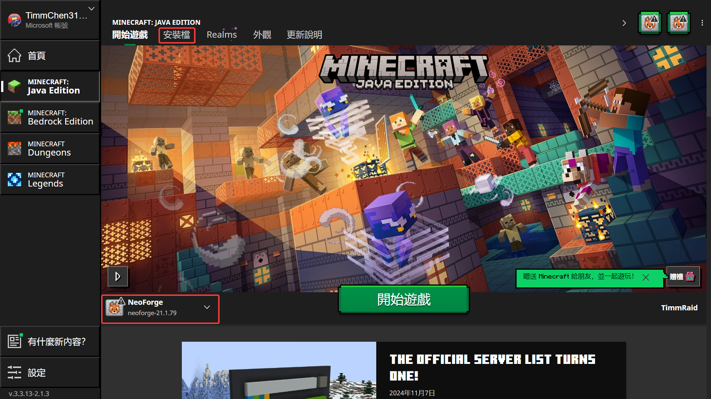
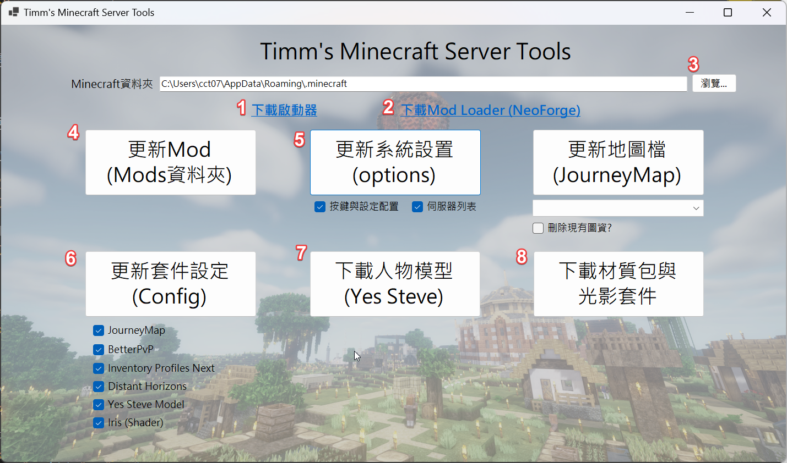
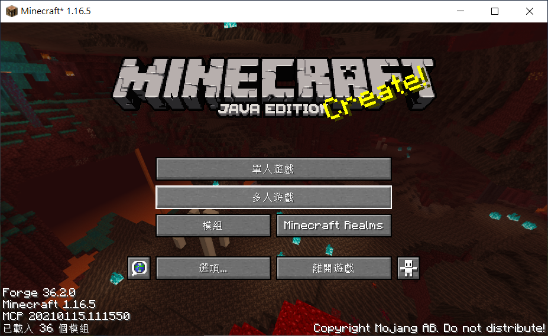
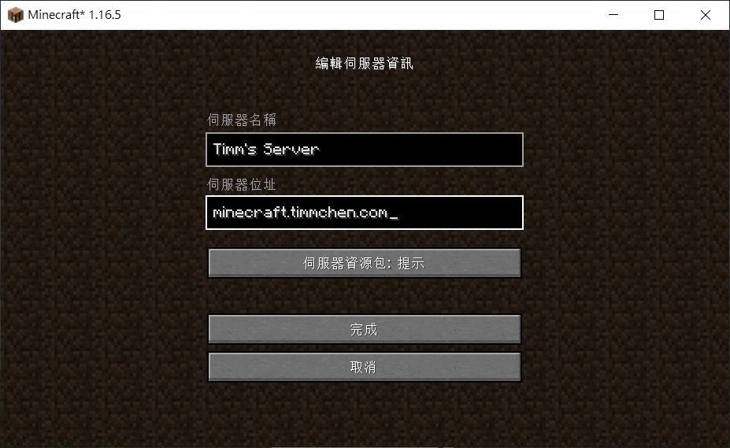
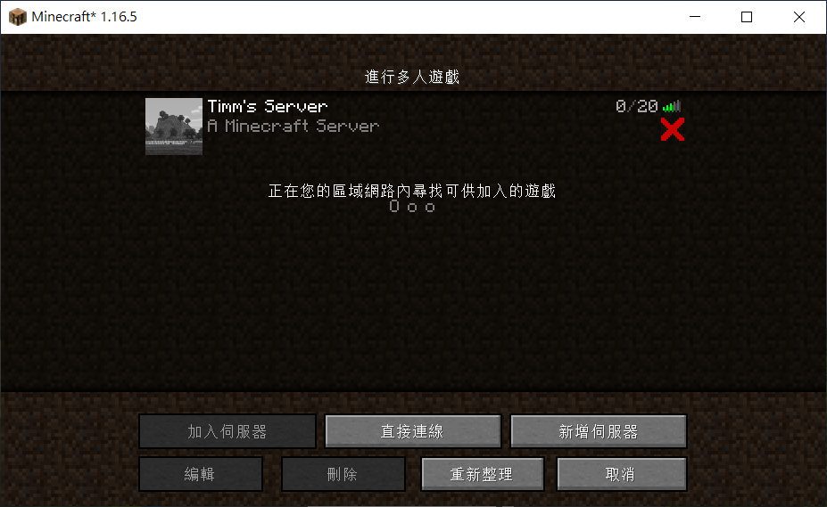

# Timm's Minecraft Server安裝方法
1. [安裝Minecraft](#i-%E5%AE%89%E8%A3%9Dminecraft)
2. [安裝MOD與初始設定](#ii-%E5%AE%89%E8%A3%9Dmod%E8%88%87%E5%88%9D%E5%A7%8B%E8%A8%AD%E5%AE%9A)
3. [連線到多人伺服器](#iii-%E9%80%A3%E7%B7%9A%E5%88%B0%E5%A4%9A%E4%BA%BA%E4%BC%BA%E6%9C%8D%E5%99%A8)
4. [匯入地圖檔](#iv-%E5%8C%AF%E5%85%A5%E5%9C%B0%E5%9C%96%E6%AA%94)
* [疑難排解](#%E7%96%91%E9%9B%A3%E6%8E%92%E8%A7%A3)

## I 安裝Minecraft
* 購買正版下載器 
  1. [購買](https://www.minecraft.net/zh-hans/store/minecraft-java-edition)帳號 (Java版) 
  2. 下載與安裝[啟動器](https://www.minecraft.net/zh-hans/download)  
  3. 下載與安裝[Forge](https://files.minecraftforge.net/net/minecraftforge/forge/index_1.16.5.html) (Mod Loader)  
    ▹ 建議版本為 1.16.5 - 36.2.0  
    ▹ 依照[此頁](https://forum.gamer.com.tw/C.php?bsn=18673&snA=154214)安裝步驟 (或參考下方圖片步驟) 
    ▹ 太麻煩的話，建議直接使用第三方Launcher，也可登入正版帳密 (MC-Launcer、MultiMC、ATLauncher都不錯用) 
  
   
  4. 開啟Launcher登入已購買的帳號  
    
  5. 新增安裝檔  
    
  6. 選剛才安裝好的 Release 1.16.5-forge-36.2.0  
    
  7. 點選"更多選項"，設定擴大RAM為4G (避免日後記憶體不足)   
    
  8. 等待安裝完成，開始遊戲即可! 
    

* 或先安裝第三方Launcher 
  ▹ [MC-Launcher](https://mc-launcher.com/launchers)  
  1. 先建立帳戶 
    
  2. 選擇正版或其他帳戶，並輸入帳密或名稱 
    
  3. 選定安裝版本(Forge 1.16.5)，按進入遊戲即可! 
    

  
## II 安裝MOD與初始設定
  1. **請下載自製"[檔案匯入小工具](https://github.com/timmchentw/Timms-Minecraft-Server/tree/main/files/Timm's%20Minecraft%20Tools)"**  
  點選按鈕進行設定檔置換 
   
  2. **點選"安裝Mods"** 
  會直接下載目前伺服器所需的所有MOD (下載期間請耐心等待) 
  ※ 注意私自安裝的MOD會一併作刪除，更新前請先備份好 
  (路徑為 C:/Users/XXX/AppData/Roaming/.minecraft/mods) 

  3. **點選"更新按鍵配置"** 
  會套用符合使用的按鍵設定、語言、資源包設定等 
  (路徑為 C:/Users/XXX/AppData/Roaming/.minecraft/options.txt) 

  4. **點選"更新套件設定"** 
  勾選右下角的目標套件在進行點選，即可套用最新的MOD設定 
  ※ BetterPvp為介面模組，有重複的小地圖功能，更新設定後會自動關閉掉 
  (路徑為C:/Users/XXX/AppData/Roaming/.minecraft/config) 
 
  ※ 匯入地圖檔請在進入多人遊戲後，再做匯入，否則找不到多人世界的資料夾! 
  ※ 日後伺服器MOD或地圖檔有更新時，再打開小工具快速更新即可!  
  
  5. **重開Minecraft，將重新讀取Mod與設定** 
  

## III 連線到多人伺服器
  1. **新增多人伺服器** 
  點選多人遊戲→新增伺服器，伺服器名稱自定義(待會匯入地圖檔會用到)、 
  網址輸入"minecraft.timmchen.com"，點選完成後直接連線  
    
    
    
  2. **送出申請表單** 
  此時進入多人遊戲後會被擋住，請先到[主頁表單連結](./read.me#%E7%94%B3%E8%AB%8B%E8%88%87%E5%AE%89%E8%A3%9D%E6%96%B9%E6%B3%95)填寫入伺服器申請， 
  送出表單後，通知OP人工核准後始可登入 
   
  Ps. 伺服器使用Simple login模組避免帳號被盜用， 
  第一次連線請輸入密碼，進入伺服器將會把此密碼存入 (之後進入遊戲不需再輸入) 
  相關注意事項如下： 
        1. 如需更改密碼：可在遊戲中輸入/sl_change_password 更改 
        2. 如忘記密碼：可以到你的電腦路徑C:\Users\XXX\AppData\Roaming\.minecraft\.sl_password中查看 
        3. 如重裝minecraft：請設定跟當初第一次進入伺服器一樣的密碼才能連線，如忘記請通知OP重設密碼 
          
        
## IV 匯入地圖檔
* Server使用JourneyMap Mod作為世界地圖，圖資生成存在自己電腦內 (自己要開黑色區域)，並可儲存WayPoints指出方位，可參考[Mod官網](https://journeymap.info/Multiplayer_Server_Map)
* 請使用上方提到的"[匯入小工具](#ii-%E5%AE%89%E8%A3%9Dmod%E8%88%87%E5%88%9D%E5%A7%8B%E8%A8%AD%E5%AE%9A)"，將最新版的全地圖檔匯入剛才新增的"多人世界" (下拉式選單選擇名稱)，重新進入世界後即可全開地圖!
* 地圖檔只會在自己周圍更新，因此推薦可造飛機多繞繞地圖~ 
    (地圖檔路徑在 C:\users\XXX\AppData\Roaming\.minecraft\journeymap\data\mp\SERVER_NAME)
      
      
    
## 疑難排解
1. 安裝有問題的話請裝[Java](https://www.java.com/zh-TW/download/manual.jsp)看看
2. 如果進入伺服器遇到Mod List不符的錯誤訊息，請再用小工具更新Mods即可
3. 伺服器列表右下角打紅色叉叉不影響進入 (此為Mod檢查，玩家Mod部分多於Server Mod數量，正常)
4. 因Mod眾多，按鈕有許多衝突，建議一定要用小工具匯入options.txt，確保按鈕都正常運作 (也可在ESC→選項→按鍵設定)
5. 預設Minecraft僅允許2GB的RAM使用量，如使用光影或較細緻的材質包切換時可能會使遊戲當掉，建議務必在啟動器的"安裝檔設定"當中將"-Xmx2G"擴大到至少"-Xmx4G"以上